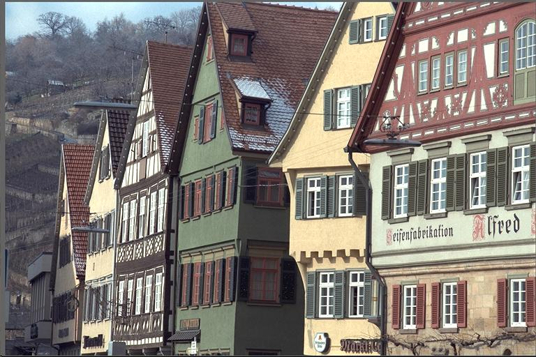
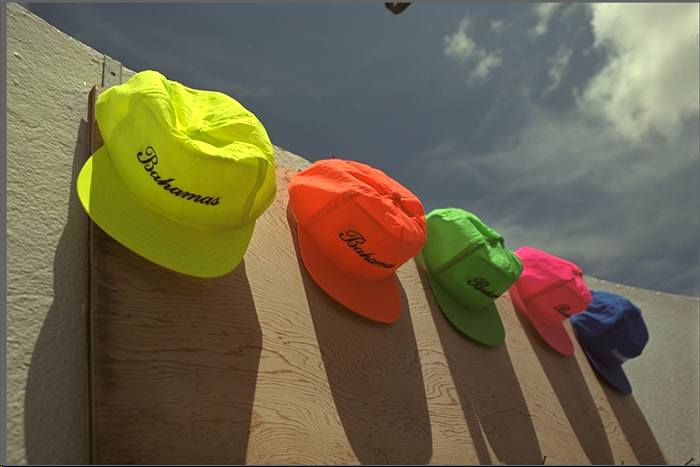
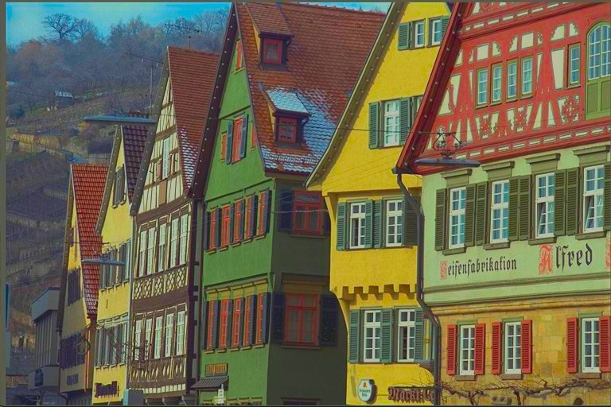
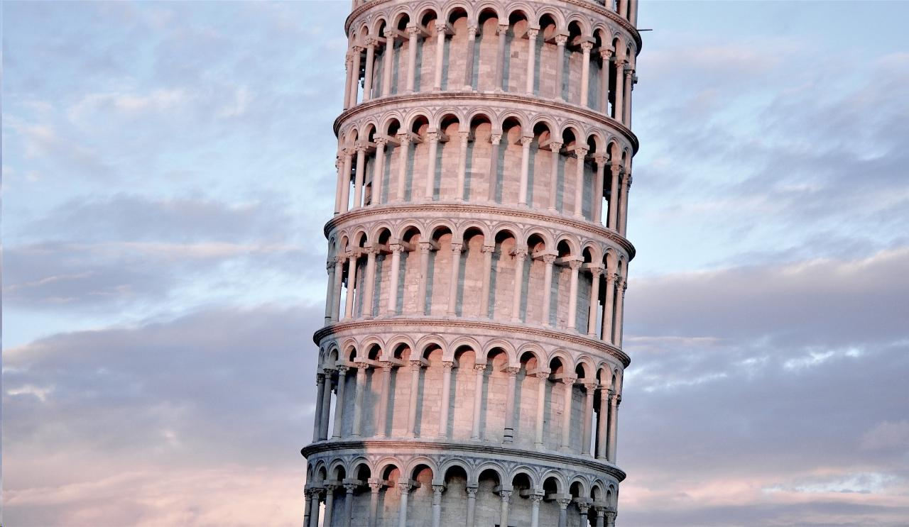
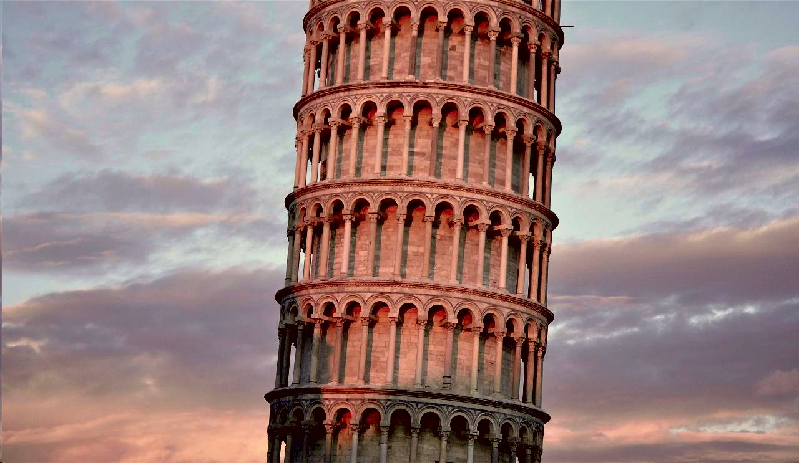

# Color transfer between images

- Paper: [Color Transfer between Images](https://www.cs.tau.ac.il/~turkel/imagepapers/ColorTransfer.pdf) by Erik Reinhard, Michael Ashikhmin, Bruce Gooch and Peter Shirley.
- This is the re-implementation based on: https://github.com/chia56028/Color-Transfer-between-Images.
- The transfer process performed in numpy array instead of looping over pixel to improve performance.
- Support on pytorch and numpy.

## Requirements

- numpy
- opencv-python
- torch (If you want to use pytorch version)

## Usage

```bash
pip install color_transfer_py==0.0.4
```

### Numpy usage

```python
import cv2
from color_transfer import color_transfer

src = cv2.imread("examples/1/src.jpeg")
target = cv2.imread("examples/1/target.png")

out = color_transfer(src, target)

cv2.imwrite("examples/1/output.jpeg", out)
```

### Pytorch usage

```python
import torch
from color_transfer import color_transfer_pytorch

# In pytorch, you can run multiple images at once
# but images must have the same size

src = torch.rand(4, 3, 224, 224)
target = torch.rand(4, 3, 224, 224)

outs = color_transfer_pytorch(src, target)
# Outs shape: (4, 3, 224, 224), output range is [0, 1]
```

## Transfer results

| Source | Target | Output |
|--|--|--|
|||  |
|||  |
|||  |
|||  |

## Benchmark results

- The benchmark results can be reproduce by running `python3 benchmark.py`


| This implementation | [chia56028 implementation](https://github.com/chia56028/Color-Transfer-between-Images) |
|--|--|
| 0.02 second | 1.337 second|
